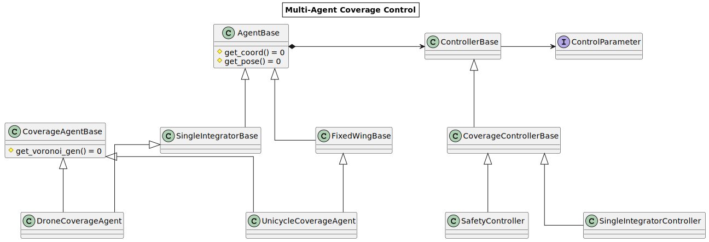

# Optimal Constrained Control of a Multi-Unicycle System

## Installation
Install the git repo
```sh
git clone ...
gir recursive update ...
```

## Folder Stucture
- [Source] - Contains the classes needed for this project: coverage control, data structure, etc. 
- [Library]- Contains the custom packages, e.g., Voronoi algorithms, parsing, fast matrix computation, etc.
- [Config.m] - Setup file used for configuring parameters.
- [Main.m] - Run

## Running
Setup the simulation by adjusting the parameters in Config.m
* Simulation Parameter: params related to the simulation, e.g., time step, number of agents
* Coverage Parameter: missions related parameters, e.g., region boundaries, ...
* Controller Parameter: specific controller parameters, e.g., gain, bounded input, velocity, etc.

Run file Main.m

## Visualization and Evaluation
The program runs and all the data is logged by the DataLogger (Source/Tools/DataLogger.m) module.

User may pause the execution and use the DataLogger module for the evaluation.

Use the instance of class DataLogger from the "Main.m" file to plot stuffs. Example

```
% Breakpoint during the main loop of Main.m
Logger.plot_Lyapunov()
Logger.plot_control_output()
Logger.plot_VM_trajectories()
...
```

User can implement a child class of Logger to clarify how they want to adjust the figures, e.g., LineWdith, Boudary Lines, etc.


## Architecture



## License

MIT

**Free Software, Hell Yeah!**
